# Test: 19-20 July 2020

## Function

The function is a golang function which runs go-routines to simulate CPU load for about 200ms and then makes an entrty in a Redis DB with a logline & a unique timestamp. It takes about 500-800ms for the function to execute.

```
$ time fission fn test --name hello-go
{" Hello, world! Time_stamp": "2020-07-19T15:57:01Z"}fission fn test --name hello-go  0.08s user 0.04s system 12% cpu 0.887 total
```

# Test Summary

|Sr No.|Virtual Users| Ramp up Plan | Total req handled| Error Rate|RPS | Request per hour (Extrapolated)|Notes|
|---|---|--- |---|---|--- |---|---|
|1 (20 July)|1000|5m 0-1000, 1000 for 30m |2566249|01%|1187|4.2M|2 nodes of c2-standard-4|
|2 (19 July)|1000|3m 0-1000, 1000 for 30m |1582901|00%|0732|2.6M|1 node of c2-standard-4 & 2 of e2-medium|
|1 (20 July)|3000|5m 0-1000, 1000 for 30m |2052633|13%|0805|2.8M|1 node of c2-standard-4 & 2 of e2-medium|

# Test 1 (20 July 2020)

The cluster is a 2 node GKE cluster with 
- 2 nodes of c2-standard-4  : 4 vCPU and 16GB RAM

K6 was run on a c2-standard-4 machines and it was fully used only for that purpose.

## 1000 virtual users test - Router Cache disabled

- The virtual user ramps up to 1000 over 5 minutes and stays at 1000 for 30 minutes.

- The function is hit 2566249 times with a 99% success rate (Just one failure) and 1200 RPS (4.3M per hour)

- Execution starts with 1 pod but scales upto 5 as load increases. The intial pod is warm (New deployment executor).


```
stages: [
        { duration: "1m",  target: 100 }, // simulate ramp-up of traffic from 1 to 500 users over 1 minutes.
        { duration: "4m",  target: 1000 }, // ramp-up to 5000 users over 4 minutes (peak hour starts)
        { duration: "30m",  target: 1000 }, // Stay at 5K users for 30 min
        { duration: "1m",  target: 0 }, // stay at 500 users for short amount of time (peak hour)
    ],
```

**K6 run summary:**

```
    ✗ status is 200
     ↳  99% — ✓ 2566249 / ✗ 1

    checks.....................: 99.99%  ✓ 2566249 ✗ 1
    data_received..............: 485 MB  224 kB/s
    data_sent..................: 267 MB  124 kB/s
    http_req_blocked...........: avg=430.81µs min=88.23µs  med=178.67µs max=231.3ms  p(5)=136.21µs p(10)=142.7µs  p(15)=147.57µs p(20)=151.83µs p(25)=155.83µs p(30)=159.77µs
    http_req_connecting........: avg=386.8µs  min=67.35µs  med=136.6µs  max=186.26ms p(5)=100.7µs  p(10)=105.87µs p(15)=109.92µs p(20)=113.51µs p(25)=116.9µs  p(30)=120.25µs
    http_req_duration..........: avg=765.21ms min=138.19µs med=612.16ms max=7.97s    p(5)=317.74ms p(10)=363.56ms p(15)=390.79ms p(20)=413.18ms p(25)=442.43ms p(30)=474.64ms
    http_req_receiving.........: avg=105.46µs min=0s       med=45.59µs  max=401.42ms p(5)=31.2µs   p(10)=33.93µs  p(15)=35.75µs  p(20)=37.24µs  p(25)=38.58µs  p(30)=39.89µs
    http_req_sending...........: avg=93.03µs  min=12.14µs  med=35.34µs  max=69.53ms  p(5)=24.5µs   p(10)=26.43µs  p(15)=27.66µs  p(20)=28.68µs  p(25)=29.64µs  p(30)=30.62µs
    http_req_tls_handshaking...: avg=0s       min=0s       med=0s       max=0s       p(5)=0s       p(10)=0s       p(15)=0s       p(20)=0s       p(25)=0s       p(30)=0s
    http_req_waiting...........: avg=765.01ms min=108.08µs med=611.96ms max=7.97s    p(5)=317.6ms  p(10)=363.4ms  p(15)=390.64ms p(20)=413.01ms p(25)=442.22ms p(30)=474.44ms
    http_reqs..................: 2566250 1187.793906/s
    iteration_duration.........: avg=765.79ms min=451.15µs med=612.77ms max=7.97s    p(5)=318.11ms p(10)=363.98ms p(15)=391.24ms p(20)=413.63ms p(25)=442.95ms p(30)=475.18ms
    iterations.................: 2566250 1187.793906/s
    vus........................: 6       min=2     max=1000
    vus_max....................: 1000    min=1000  max=1000
```

### Resource Consumption

#### Router

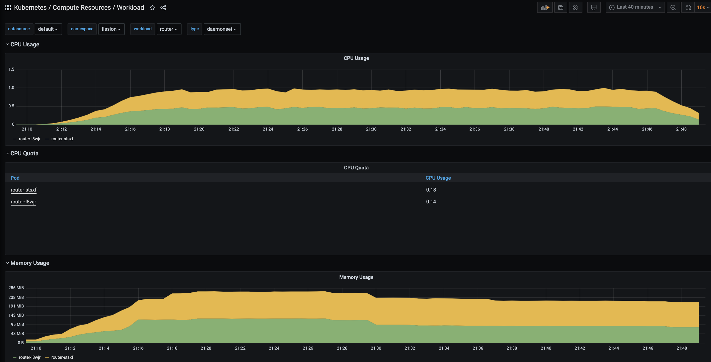

#### Function pods

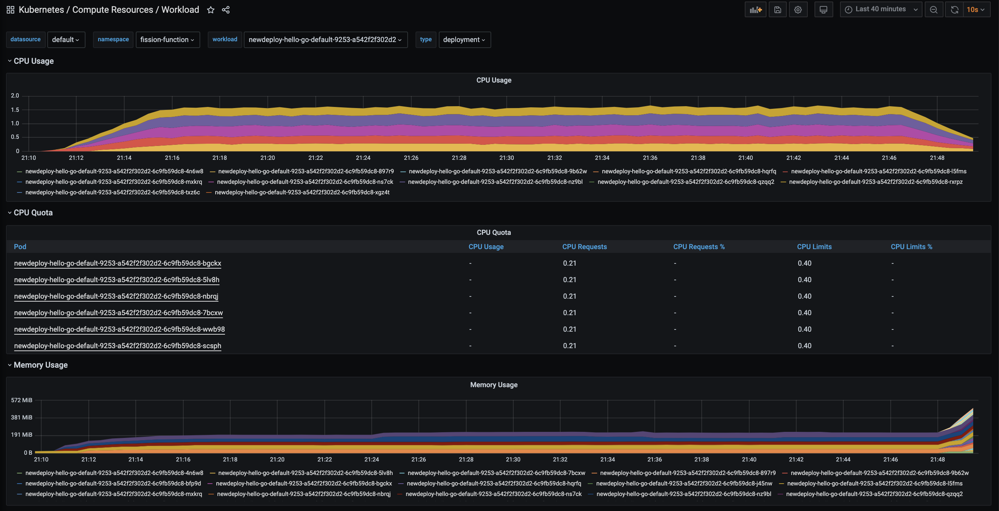

#### Executor

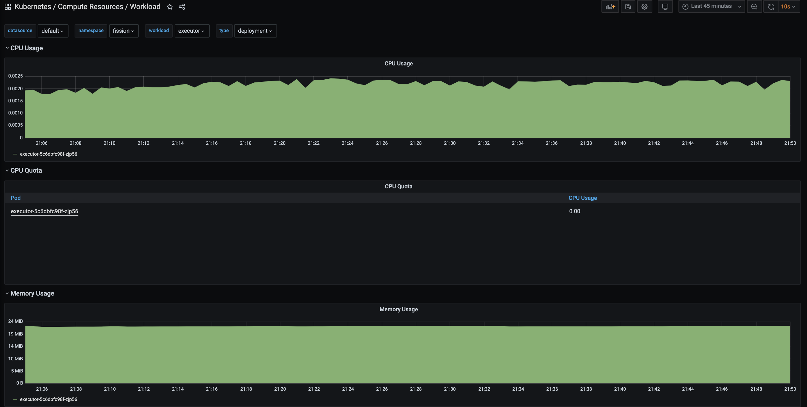

#### Prometheus Server

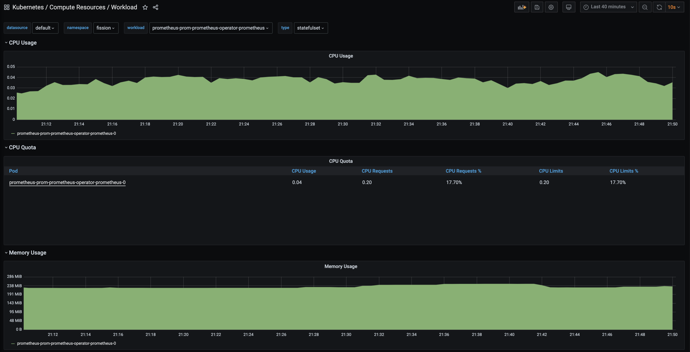

#### Cluster

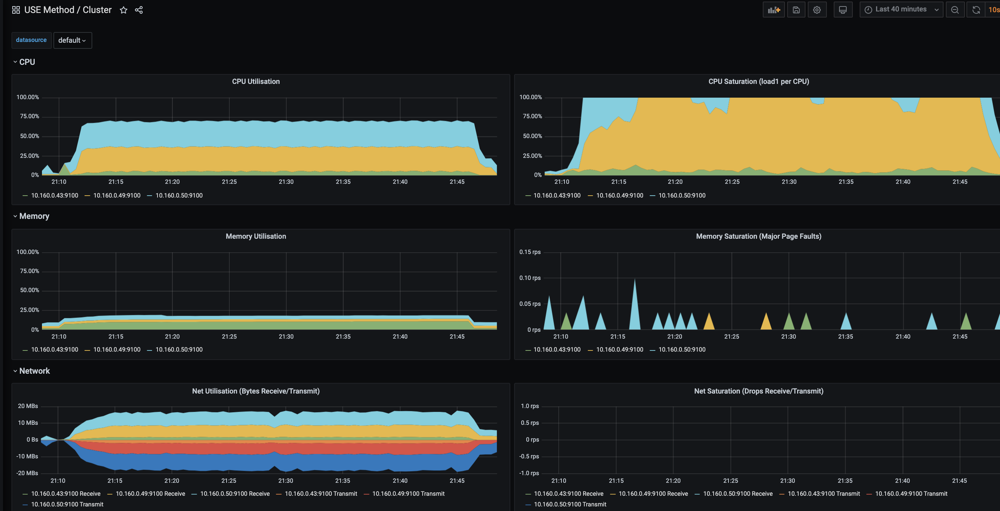

# Test 2 (19 July 2020)

The cluster is a 3 node GKE cluster with 
- 2 nodes of e2-medium      : 2 vCPU and 04GB RAM (CPU each at 50% time)
- 1 nodes of c2-standard-4  : 4 vCPU and 16GB RAM

K6 was run on a c2-standard-4 machines and it was fully used only for that purpose

## 1000 virtual users test

- The virtual user ramps up to 1000 over three minutes and stays at 1000 for 30 minutes.

- The function is hit 1582901 times with a 100% success rate

- Only a single function pod runs throughout the test with 400mc CPU limit. The pod is warm (New deployment executor).

```
    stages: [
        { duration: "1m",  target: 100 }, // simulate ramp-up of traffic from 1 to 500 users over 1 minutes.
        { duration: "2m",  target: 1000 }, // ramp-up to 5000 users over 4 minutes (peak hour starts)
        { duration: "30m",  target: 1000 }, // Stay at 5K users for 30 min
        { duration: "1m",  target: 0 }, // stay at 500 users for short amount of time (peak hour)
    ],

```

**K6 run summary:**


```

    ✓ status is 200

    checks.....................: 100.00% ✓ 1582901 ✗ 0
    data_received..............: 299 MB  138 kB/s
    data_sent..................: 165 MB  76 kB/s
    http_req_blocked...........: avg=1.34ms   min=67.47µs  med=463.74µs max=1.04s    p(5)=130.66µs p(10)=159.09µs p(15)=178.89µs p(20)=197.26µs p(25)=217.82µs p(30)=243.58µs
    http_req_connecting........: avg=1.28ms   min=44.69µs  med=412.6µs  max=1.04s    p(5)=86.97µs  p(10)=116.08µs p(15)=135.06µs p(20)=151.85µs p(25)=170.9µs  p(30)=195.81µs
    http_req_duration..........: avg=1.24s    min=503.49ms med=1.2s     max=3.92s    p(5)=764.61ms p(10)=873.21ms p(15)=910.59ms p(20)=991.94ms p(25)=1.01s    p(30)=1.08s
    http_req_receiving.........: avg=381.02µs min=16.49µs  med=73.3µs   max=133.64ms p(5)=36.23µs  p(10)=39.73µs  p(15)=42.5µs   p(20)=45.35µs  p(25)=48.67µs  p(30)=52.32µs
    http_req_sending...........: avg=285.29µs min=11.96µs  med=54.42µs  max=134.45ms p(5)=27.46µs  p(10)=29.87µs  p(15)=32.05µs  p(20)=34.25µs  p(25)=36.4µs   p(30)=38.51µs
    http_req_tls_handshaking...: avg=0s       min=0s       med=0s       max=0s       p(5)=0s       p(10)=0s       p(15)=0s       p(20)=0s       p(25)=0s       p(30)=0s
    http_req_waiting...........: avg=1.23s    min=503.38ms med=1.2s     max=3.92s    p(5)=763.61ms p(10)=872.34ms p(15)=909.88ms p(20)=991.33ms p(25)=1.01s    p(30)=1.08s
    http_reqs..................: 1582901 732.67824/s
    iteration_duration.........: avg=1.24s    min=504.28ms med=1.21s    max=3.92s    p(5)=766.89ms p(10)=875.26ms p(15)=911.97ms p(20)=993.35ms p(25)=1.01s    p(30)=1.08s
    iterations.................: 1582901 732.67824/s
    vus........................: 6       min=2     max=1000
    vus_max....................: 1000    min=1000  max=1000

```

### Resource Consumption

**Router**
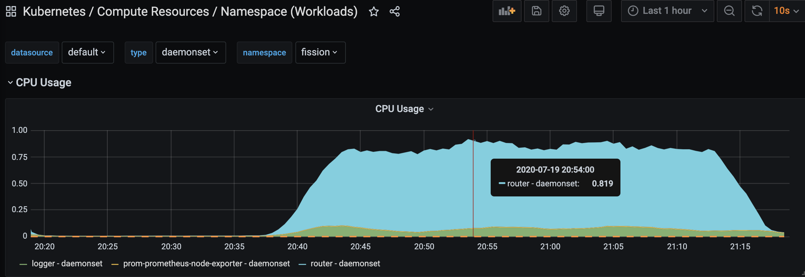

**Function Pod**
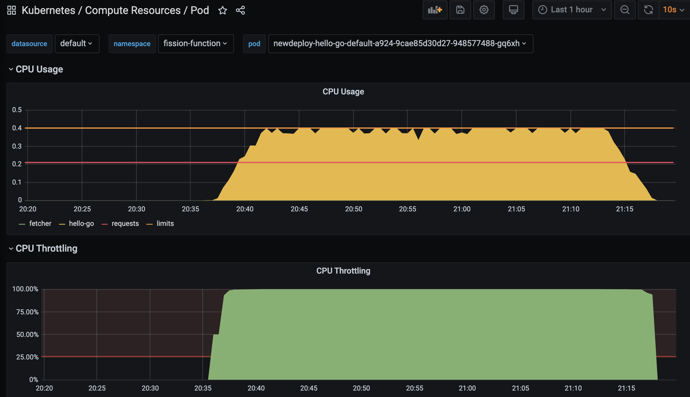


## 3000 virtual users test


- The virtual user ramps up to 3000 over 11 minutes and stays at 3000 for 30 minutes.

- The function is hit 2052633 times with a 87% success rate (✓ 1791067 / ✗ 261566)

- Five pods of function are running with each 200mc requests, 400mc limit and 128MB resource and 512MB limit. The pod is warm (New deployment executor)


**K6 run summary:**

```
   ✗ status is 200
     ↳  87% — ✓ 1791067 / ✗ 261566

    checks.....................: 87.25%  ✓ 1791067 ✗ 261566
    data_received..............: 390 MB  153 kB/s
    data_sent..................: 214 MB  84 kB/s
    http_req_blocked...........: avg=77.8ms  min=75.64µs  med=34.13ms max=3.26s  p(5)=301.89µs p(10)=643.09µs p(15)=1.33ms   p(20)=2.7ms    p(25)=5.39ms   p(30)=9.38ms
    http_req_connecting........: avg=76.96ms min=50.18µs  med=33.6ms  max=3.26s  p(5)=240.23µs p(10)=567.37µs p(15)=1.22ms   p(20)=2.54ms   p(25)=5.13ms   p(30)=9.07ms
    http_req_duration..........: avg=3.04s   min=745.59µs med=1.63s   max=59.98s p(5)=83.68ms  p(10)=263.98ms p(15)=349.13ms p(20)=449.79ms p(25)=571.78ms p(30)=719.51ms
    http_req_receiving.........: avg=23.34ms min=0s       med=10.5ms  max=2.35s  p(5)=55.11µs  p(10)=81.5µs   p(15)=153.9µs  p(20)=323.32µs p(25)=631.76µs p(30)=1.17ms
    http_req_sending...........: avg=16.48ms min=15.91µs  med=4.52ms  max=1.14s  p(5)=38.17µs  p(10)=49.18µs  p(15)=69.55µs  p(20)=112.99µs p(25)=206.8µs  p(30)=375.31µs
    http_req_tls_handshaking...: avg=0s      min=0s       med=0s      max=0s     p(5)=0s       p(10)=0s       p(15)=0s       p(20)=0s       p(25)=0s       p(30)=0s
    http_req_waiting...........: avg=3s      min=645.3µs  med=1.59s   max=59.98s p(5)=53.28ms  p(10)=249.55ms p(15)=327.68ms p(20)=416.81ms p(25)=531.22ms p(30)=679.78ms
    http_reqs..................: 2052633 805.605792/s
    iteration_duration.........: avg=3.13s   min=1.09ms   med=1.78s   max=1m0s   p(5)=142.58ms p(10)=300.31ms p(15)=402.33ms p(20)=523.1ms  p(25)=660.08ms p(30)=808.78ms
    iterations.................: 2052633 805.605792/s
    vus........................: 1       min=1     max=3000
    vus_max....................: 3000    min=3000  max=3000
```    

### Resource Consumption

#### Router

##### CPU

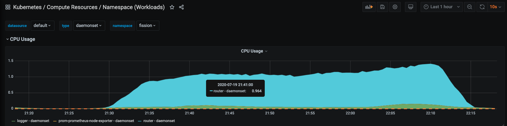

##### Memory

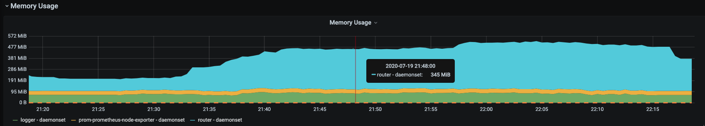

#### Function pods

##### CPU

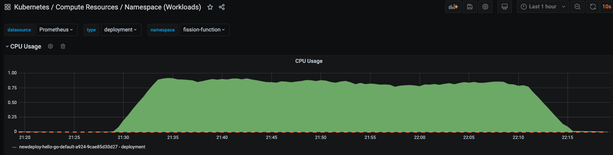

##### Memory

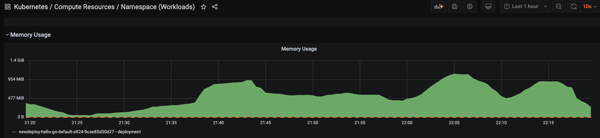

## Overall Comments

### Function Pods

- While a single pod seems to handle load pretty well in first run (1K), the second run had some failures and load got among the pods as shown below. Potentially the Kubernetes service routing might have hit some issues, but needs investigation.

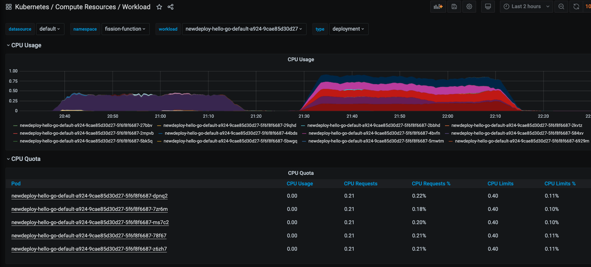

### Router

- Router was run as a daemonset in both scenarios

- Router cumulatively was taking 0.75 CPU in first run and close to 1.4 CPU in second case.

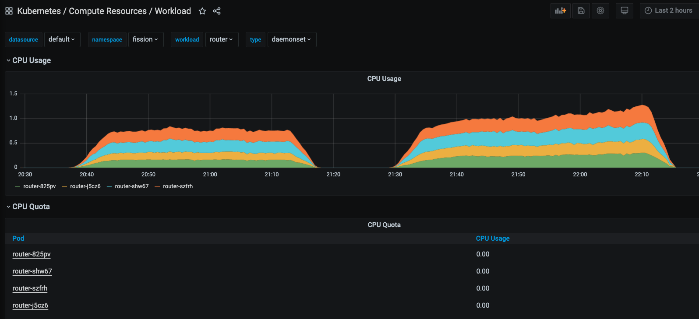

### Summary

- Based on data it seems reasonable that with 1CPU for Router and 0.5CPU for function pod it is possible to support 750 RPS (45K requests per minute/ 2.7M Per hour) - and rest of components consuming fairly less resources.